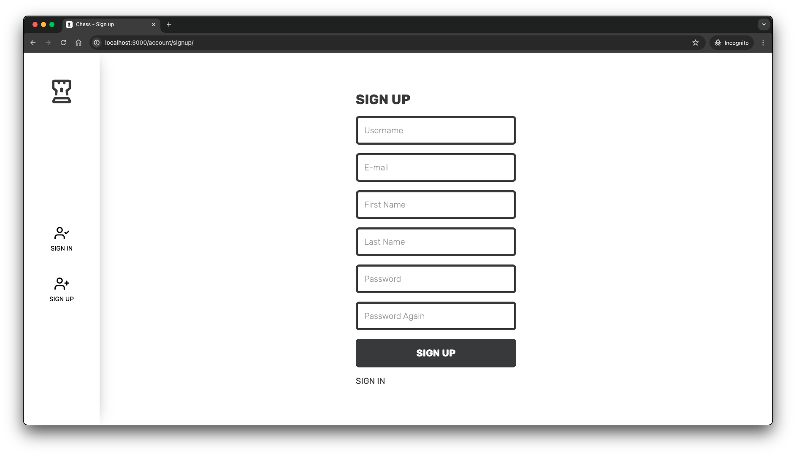

# Chess


### How to run an app
```bash
cd app

npm install
npm start
```

then open a new terminal and run

```bash
cd api
pip install -r requirements.txt
python manage.py migrate
python manage.py runserver
```

default port for front is 3000
and for back is 8000 you can change it in env files

### What technologies are used in the project?

#### Front:
1. React JS
2. Styled Components
3. Eslint
4. Prettier

#### Back:
1. Django
2. Django channels
3. Sqlite


### A couple of screenshots:



